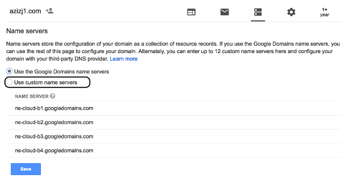

# Google Calendar Analytics
Express.js RESTful API that uses [Google Calendar API](https://developers.google.com/calendar/) to inquire my private calendars.

## Swagger / Demo
Production swagger can be found [here](https://api.azizj1.com/docs/). Dev environment swagger can be found [here](https://devapi.azizj1.com/docs/). 

## Getting Started
Being a node app, the app has a few prerequisites.

### Prerequisites
* Node v8.10+. The project is deployed to AWS Lambda envrionment with node 8.10, so babel polyfills up to that version. 
* Yarn globally installed (`npm i yarn -g`).
* Access to your private Google Calendar. See [below for instructions](#grant-read-access-to-private-google-calendars).

### Developing
Install all project dependencies
```
yarn
```
Confirm you have `./credentials.json` (see [accessing private calendars](#grant-read-access-to-private-google-calendars)), whether it's downloading it from [Google Cloud Platform](https://console.cloud.google.com) or accessing it from your secrets S3 bucket by doing 
```
yarn get-secret
```

While developing, kick off watcher with hot-reload
```
yarn watch
```

To just run the server locally, 
```
yarn start
```
## Deployment
The API is deployed to AWS Lambda + API Gateway using Terraform.

Two deployment options are supported:
1. Without a custom domain and using the unique URL that API Gateway generates (e.g., https://oswh3xvy12.execute-api.us-east-1.amazonaws.com/prod/docs/)
2. With a custom domain (e.g., https://api.azizj1.com/docs/)

Each come with a dev environment (https://dr7dranbgi.execute-api.us-east-1.amazonaws.com/dev/docs/ and https://devapi.azizj1.com/docs/).

The prerequisites will describe how you can use either, starting with what's common in both.

### Prerequisites

Download the following and have it available in `PATH` or `/usr/local/bin/`:
* [AWS CLI](https://docs.aws.amazon.com/cli/latest/userguide/installing.html)
* [Terraform 0.11+](https://www.terraform.io/)

Setup a [named profile](https://docs.aws.amazon.com/cli/latest/userguide/cli-multiple-profiles.html) called **aws-cli** by
```
aws configure --profile aws-cli
```
User `aws-cli` must have the ablity to
* Create IAM roles
* Create API Gateways
* Create Lambdas
* Store/retrieve files from S3 (for terraform state files and Google Calendar API secrets)
* If you'd like Terraform to create a bucket, `aws-cli` must also be able to create S3 buckets.

If you plan on having custom domains for the API, `aws-cli` must also be able to
* Create/get Route53 zones and records
* Create certificates in AWS Certificate Manager
* Update CloudFront distributions

If you're feeling lazy, attach policies
* `AmazonAPIGatewayAdministrator`
* `IAMFullAccess`
* `AWSLambdaFullAccess`
* `AmazonS3FullAccess`
* `CloudFrontFullAccess`
* `AmazonRoute53FullAccess`
* `AWSCertificateManagerFullAccess`

to the user. If you're concerned about security, don't add any policies and just run the deployments. Terraform will error, but it'll inform you what permission is needed to continue. Add that specific permission to the user, and run it again. Do this until Terraform succeeds.

#### S3 Bucket
Next, it's highly encouraged to have an S3 bucket for this project. This S3 bucket will store all the Terraform state files, and it can optionally store your `./credentials.json` once you get it ([below](#grant-read-access-to-private-google-calendars)). 

If you would like to use an existing S3 bucket,
1. Update `./terraform/s3_bucket_name.txt` with the bucket name
2. You're done.

If you would like to create a new S3 bucket for this and use that one,
1. Update `./terraform/s3_bucket_name.txt` with new bucket name
2. `yarn create-s3-bucket`
3. You're done.

If you would like to **not** use an S3 bucket, comment out `terraform { ... }` block from all `config.tf` files
  - `./terraform/custom-domain-setup/certificate/config.tf`
  - `./terraform/custom-domain-setup/main-zone/config.tf`
  - `./terraform/environments/dev/config.tf`
  - `./terraform/environments/prod/config.tf`

#### Deploying Without a Custon Domain
No additional steps are needed. Move onto deploying [dev environment](#dev-environment).

#### Deploying with a Custon Domain
1. Get a custom domain, one that you have DNS access to. E.g., [Google Domains](https://domains.google.com/), [GoDaddy](https://www.godaddy.com/), etc. 
2. Run `yarn custom-domain-setup` (or `yarn custom-domain-setup-win` for Windows). It'll create four custom name servers.
3. Navigate into your domain's DNS settings and find "custom name servers." Update those name servers to the one printed in console from previous command. E.g., in Google Domains, custom name servers are at

    
4. Press `enter` to continue, which will now create a certificate using AWS Certificate Manager and validate it with your domain. 
    - *Note*: This can take several minutes to do.

That's it. Move onto deploying [dev environment](#dev-environment).

#### Deploying with a Custom Domain After Deploying Without
If you've already deployed without a custom domain, the instructions to deploy with a custom domains **do not** change, regardless of you deploying without a custom domain beforehand or not. 

Just follow the instructions [above](#deploying-with-a-custon-domain).

#### What additional resources are deployed for a custom domain.
1. A Route 53 Zone (let's call it `zone.main`) that manages your entire domain's DNS (e.g., `*.azizj1.com.`). This access is granted by changing the name servers on your domain registration service (Google Domains, GoDaddy, etc.) in step 3 above.
2. A certificate for `*.azizj1.com.` is requested using AWS Certificate Manager. To validate that you actually own the domain you say you do, AWS Certificate Manager requires a unique CNAME to be added to yor domain's DNS. Since `zone.main` manages that, we add a CNAME record to `zone.main`.
3. Wait for the certificate to be validated.
4. Create another Route 53 Zone (call it `zone.api`) that manages all requests to the `api` subdomain (e.g., `api.azizj1.com.` or `devapi.azizj1.com.`). 
5. To tell `zone.main` to route all `api` subdomain calls to `zone.api`, we create NS records in `zone.main` equal to `zone.api`'s NS values.
6. After everything above and lambda and api gateway are created, create a **Custom Domain Names** in API Gateway. Domain name being `api.azizj1.com`, ACM certificate being the certificate from #2, and a base path mapping from `/` to the API Gateway ARN + stage. 
7. The step above creates a CloudFront distribution, which allows your API to be edge optimized. Back in Route 53, An A Route (IPv4 Address) record is created in `zone.api` as an alias that points to the CloudFront distribution.

And that's it! You can see the changes by logging into your [AWS Console](https://console.aws.amazon.com/console/home).

### Dev Environment
```
yarn deploy
```
on macOS, or
```
yarn deploy-win
```
on Windows.

**Note**: If you're deploying with a custom domain for the first time, note that it can take several minutes for your API to become available.

### Prod Environment
```
yarn deploy-prod
```
on macOS, or
```
yarn deploy-prod-win
```
on Windows.

**Note**: If you're deploying with a custom domain for the first time, note that it can take several minutes for your API to become available.

## Teardown
Thanks to Terraform, tearing down your deployments is built-in.

### Dev Environment Teardown
```
yarn teardown
```
on macOS, or
```
yarn teardown-win
```
on Windows.

### Prod Environment Teardown
```
yarn teardown-prod
```
on macOS, or
```
yarn teardown-prod-win
```
on Windows.

### Custom Domain Teardown
Before you can tear down your certificate and main AWS Route53 Zone, you must
1. Tear down both dev and prod.
2. Wait about 30mins for certificate to declared *not in use*.

When ready, run
```
yarn custom-domain-teardown
```
on macOS, or
```
yarn custom-domain-teardown-win
```
on Windows.

## Grant Read Access to Private Google Calendars
### Get Key JSON File
1. Log into [Google Cloud Platform](https://console.cloud.google.com).
2. Create a project called `google-calendar-analytics`.
3. On the left sidemenu, go to API & Services > Dashboard.
4. Click on `Enable APIs and Services`.
5. Enable `Google Calendar API`.
6. On the new left sidemenu, click on `Credentials.`
7. Create `Service account key`.
    - Sevice account: New service account
    - Service account name: `server-owner`
    - Role: Project > Owner
    - Key type: JSON
    - Click create. A JSON file will be downloaded.
8. Place the downloaded file in root directory (same directory as this README.md).
9. Rename it to `credentials.json`.
10. (Optional) If you have [AWS CLI](https://docs.aws.amazon.com/cli/latest/userguide/installing.html) setup with S3 access, you can store the secret in S3 by doing `yarn store-secret`, which you can then later retrieve in a different machine if need be by doing `yarn get-secret`.
    - You'll need to update `./package.json` file appropriately for this to work.

### Share Calendar with Service Account
Navigate to [Google Calendar](https://calendar.google.com) and give the Service account you just created read-only access to your BJJ calendar.
1. Navigate to calendar's "Settings and sharing".
2. Share your BJJ calendar with the `client_email` (of the form `server-owner@*.gserviceaccount.com`) found in the JSON file you downloaded earlier.

    

3. Scroll all the way down and get the Calendar ID (of the form `*@group.calendar.google.com`).
4. Update `./calendars.json` with your BJJ calendar ID under `fitness`. **Don't** update the keys (e.g., `fitness`), only update the values. If you do want to update the names, also update `./src/api/calendarApi.ts`. 

## License
MIT License

Copyright (c) 2018 Aziz Javed

Permission is hereby granted, free of charge, to any person obtaining a copy
of this software and associated documentation files (the "Software"), to deal
in the Software without restriction, including without limitation the rights
to use, copy, modify, merge, publish, distribute, sublicense, and/or sell
copies of the Software, and to permit persons to whom the Software is
furnished to do so, subject to the following conditions:

The above copyright notice and this permission notice shall be included in all
copies or substantial portions of the Software.

THE SOFTWARE IS PROVIDED "AS IS", WITHOUT WARRANTY OF ANY KIND, EXPRESS OR
IMPLIED, INCLUDING BUT NOT LIMITED TO THE WARRANTIES OF MERCHANTABILITY,
FITNESS FOR A PARTICULAR PURPOSE AND NONINFRINGEMENT. IN NO EVENT SHALL THE
AUTHORS OR COPYRIGHT HOLDERS BE LIABLE FOR ANY CLAIM, DAMAGES OR OTHER
LIABILITY, WHETHER IN AN ACTION OF CONTRACT, TORT OR OTHERWISE, ARISING FROM,
OUT OF OR IN CONNECTION WITH THE SOFTWARE OR THE USE OR OTHER DEALINGS IN THE
SOFTWARE.
